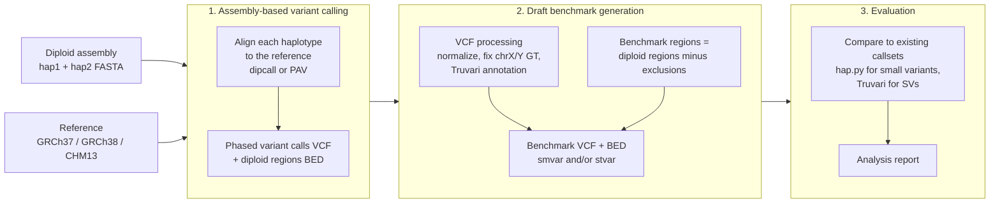

# DeFrABB: Development Framework for Assembly-Based Benchmarks

[](https://doi.org/10.64898/2026.09.23.752440)
[](https://snakemake.github.io)
[](LICENSE)

DeFrABB is the [Snakemake](https://snakemake.github.io) workflow the
[Genome in a Bottle (GIAB)](https://www.nist.gov/programs-projects/genome-bottle)
consortium at NIST uses to build small-variant and structural-variant benchmark
sets from accurate diploid genome assemblies. It takes a phased diploid assembly
and a reference genome (GRCh37, GRCh38, or T2T-CHM13v2.0). From these it
produces benchmark variants (VCF) and benchmark regions (BED), and evaluates
the drafts against existing high-quality callsets.

DeFrABB was used to generate the **GIAB HG002 v5.0q** benchmark sets from the
T2T HG002 Q100 v1.1 assembly. These are described in:

> Olson ND, Dwarshuis N, Hansen NF, _et al._ The Genome In A Bottle HG002
> assembly-based variant benchmark set enables comprehensive benchmarking of
> small and structural variants. _bioRxiv_ (2026).
> <https://doi.org/10.64898/2026.09.23.752440>

## Status and intended audience

This repository is developed primarily for internal GIAB benchmark development.
It is public so that benchmark generation is transparent and reproducible, not
as a general-purpose, supported end-user tool. The documentation aims to explain
what the pipeline does and how a given benchmark was produced. Issues are
welcome, and support is best-effort (see [CONTRIBUTING.md](CONTRIBUTING.md)).

The canonical repository is NIST-internal GitLab. The public mirror at
<https://github.com/usnistgov/defrabb> is updated at each release.

## How it works

DeFrABB has three components (Fig. 1a of the preprint):



1. **Assembly-based variant calling.** Each assembly haplotype is aligned to the
   reference. Variants are called from the alignments, and _diploid regions_ are
   defined: regions where both haplotypes align 1:1 to the reference.
   [dipcall](https://github.com/lh3/dipcall) and
   [PAV](https://github.com/BeckLaboratory/pav) are supported, and caller
   parameters are configurable.
2. **Draft benchmark generation.** Variant calls are normalized (bcftools) and
   annotated (Truvari `svinfo`, `trf`, `repmask`, `remap`). Genotypes in non-PAR
   chrX/chrY are converted to haploid representation. Benchmark regions are
   the diploid regions minus _exclusions_: genomic contexts where the assembly,
   the variant calls, or the benchmarking tools are not reliable. Examples
   include assembly gaps and their flanks, large repeats with alignment breaks,
   regions with SVs (for small-variant benchmarks), known assembly errors,
   discrepancies between callers, and a _self-discrepancy_ step that excludes
   variants the benchmarking tools cannot compare to themselves.
3. **Evaluation.** Each draft benchmark is compared against established callsets
   with [hap.py](https://github.com/Illumina/hap.py) (small variants) or
   [Truvari](https://github.com/ACEnglish/truvari) (SVs). Results are summarized
   in an analysis report used for QC and parameter iteration.

Draft benchmarks are then curated and evaluated by external groups before
release. That curation happens outside this pipeline (see the preprint).

More detail:

- [docs/exclusion_system_guide.md](docs/exclusion_system_guide.md): how
  exclusions are defined, configured, and applied
- [docs/architecture-diagram.md](docs/architecture-diagram.md): rule-level
  diagram of the workflow
- [docs/README.md](docs/README.md): index of all documentation

## Benchmarks produced with DeFrABB

| Benchmark                  | Assembly            | References                | DeFrABB version                                                    | Run configuration                                                                                        | Files                                                                                                          |
| -------------------------- | ------------------- | ------------------------- | ------------------------------------------------------------------ | -------------------------------------------------------------------------------------------------------- | -------------------------------------------------------------------------------------------------------------- |
| HG002 v5.0q (smvar, stvar) | HG002 T2T Q100 v1.1 | GRCh37, GRCh38, CHM13v2.0 | [v0.020](https://github.com/usnistgov/defrabb/releases/tag/v0.020) | [`config/analyses_20250117_v0.020_HG002Q100v1.1.tsv`](config/analyses_20250117_v0.020_HG002Q100v1.1.tsv) | [GIAB FTP](https://ftp.ncbi.nlm.nih.gov/ReferenceSamples/giab/release/AshkenazimTrio/HG002_NA24385_son/v5.0q/) |

Every released benchmark directory includes a `defrabb_files/` folder with the
analyses table, resource configuration, and Snakemake report for the run that
produced it. To inspect the exact code, check out the listed tag:

```sh
git clone https://github.com/usnistgov/defrabb.git
cd defrabb
git checkout v0.020
```

Versioned analyses tables (`config/analyses_YYYYMMDD_v0.###_<id>.tsv`) are kept
for every production run, so each run's configuration stays in version control.

## Quick start

### Requirements

- Linux
- [Snakemake](https://snakemake.github.io) ≥ 8.30
- conda or mamba (rule-specific software environments are created from `envs/`)
- [Apptainer](https://apptainer.org) (PAV runs in a container)
- `boto3` if you use the `run_defrabb` wrapper

Whole-genome runs need a large-memory server: PAV peaks at about 65 GB and
hap.py at 95–150 GB on whole-genome HG002. The bundled chr21 test
configuration runs on a workstation.

### Run the chr21 test analysis

```sh
git clone https://github.com/usnistgov/defrabb.git
cd defrabb
snakemake --use-conda --use-apptainer --cores 4
```

This uses `config/analyses.tsv`, a small HG002 chr21 dipcall example.

### Configure your own analysis

A run is defined by two files:

- **`config/resources.yml`**: inputs and parameters. It holds assembly and
  reference URLs, exclusion region definitions and named exclusion sets,
  comparison callsets, stratifications, named parameter profiles, and compute
  resources. Validated by
  [`schema/resources-schema.yml`](schema/resources-schema.yml).
- **an analyses table (TSV)**: one row per evaluation. Each row picks an
  assembly, reference, variant caller and parameters, benchmark type (`smvar` or
  `stvar`), VCF processing steps, exclusion set, and evaluation tool and
  comparison callset. Validated by
  [`schema/analyses-schema.yml`](schema/analyses-schema.yml).

```sh
snakemake --use-conda --use-apptainer --cores 32 \
  --resources mem_mb=200000 \
  --config analyses=config/analyses_<RUNID>.tsv
```

Pass `--resources mem_mb=<budget>` for whole-genome runs, so Snakemake does not
schedule several memory-heavy jobs at once. See [config/README.md](config/README.md)
for an overview of the configuration files.

### Using the `run_defrabb` wrapper

For production runs, `run_defrabb` wraps Snakemake and records provenance: git
state, the conda environment, and the run log. It also provides `report`,
`archive`, and `release` steps. Each run happens in a fresh clone named after
its run ID (`YYYYMMDD_v#.###_<brief-id>`):

```sh
git clone https://github.com/usnistgov/defrabb.git 20260519_v0.023_HG002
cd 20260519_v0.023_HG002
./run_defrabb run -r 20260519_v0.023_HG002   # uses config/analyses_<RUNID>.tsv
./run_defrabb report -r 20260519_v0.023_HG002
```

Run `./run_defrabb --help` for all subcommands. The archive and release defaults
(NAS paths, S3 buckets) are NIST-specific. Override them with `--archive_dir`,
`--s3_bucket`, and `--s3_path`.

## Outputs

| Path                                                        | Contents                                                                        |
| ----------------------------------------------------------- | ------------------------------------------------------------------------------- |
| `results/asm_varcalls/{vc_id}/`                             | Raw assembly-based variant calls, diploid-region BEDs, and haplotype alignments |
| `results/draft_benchmarksets/{bench_id}/`                   | Draft benchmark sets (see below)                                                |
| `results/evaluations/{happy,truvari}/{eval_id}_{bench_id}/` | Evaluation output against comparison callsets                                   |
| `results/report/`, `analysis.html`                          | Summary statistics and the run's analysis report                                |
| `logs/`, `benchmark/`                                       | Per-rule logs and runtime/memory benchmarks                                     |

Each draft benchmark set directory contains, per `{ref}_{asm}_{smvar|stvar}_{caller}-{params}`:

- `*.vcf.gz`: benchmark variants (processed and annotated assembly-based calls)
- `*.benchmark.bed`: benchmark regions (diploid regions minus exclusions)
- `*_bench-vars.vcf.gz`: benchmark variants restricted to benchmark regions
- `*.exclusion_stats.txt`, `*.exclusion_provenance.yml`: how much sequence each
  exclusion removed, and the exact exclusion inputs and parameters used

When benchmarking a callset against a DeFrABB benchmark, use the VCF together
with its `benchmark.bed`. Variants outside the BED are not assessed.

## Known issues and limitations

- By design, benchmarks exclude very large or complex SVs, CNVs, and regions
  where the assembly does not align 1:1 to the reference. No standards exist
  for representing and comparing variants in those regions.
- Investigation write-ups for pipeline-specific workarounds (FIPS-mode hosts,
  Truvari bugs, PAV/dipcall failure modes) are in [docs/issues/](docs/issues/).

## Repository layout

```txt
Snakefile        workflow entry point
rules/           Snakemake rule modules (variant calling, exclusions, VCF processing, evaluation, report)
scripts/         Python, R, and shell helpers used by rules
config/          resources.yml, analyses tables (one per production run), sweep configs
schema/          JSON schemas for the configuration files
envs/            per-rule conda environments
analysis.qmd     Quarto source for the run analysis report
run_defrabb      provenance-recording wrapper (run / report / archive / release)
.tests/          pytest unit tests and chr21 integration resources
docs/            method and user documentation
```

## Citation

If you use DeFrABB or benchmarks generated with it, please cite the preprint
above.

## License

DeFrABB is NIST-developed software. See [LICENSE](LICENSE) for the NIST software
licensing statement.
