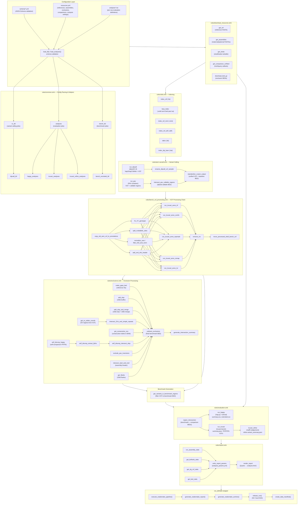
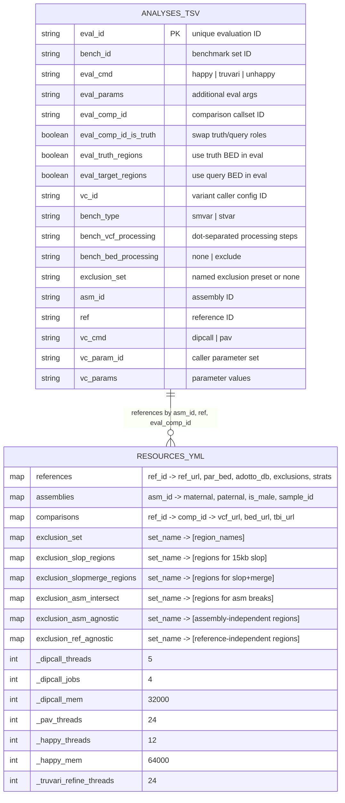
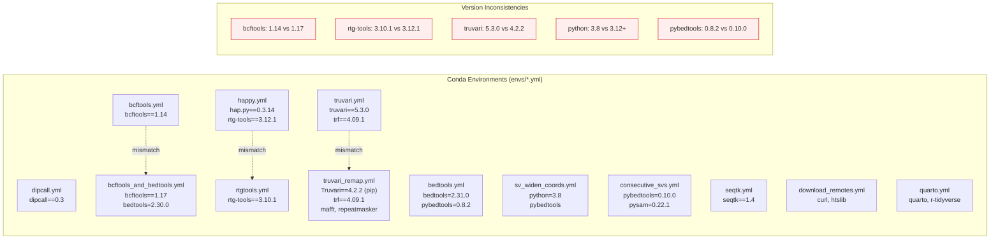

# DeFrABB Pipeline Architecture Diagram

_Prepared: 2026-03-24_

## High-Level Pipeline Flow



## Configuration Data Model



## Conda Environment Dependency Map



## Output Directory Structure

```text
results/
+-- asm_varcalls/{vc_id}/
|   +-- {ref}_{asm}_{vc_cmd}-{vc_param}.dip.vcf.gz[.tbi]      # dipcall output
|   +-- {ref}_{asm}_{vc_cmd}-{vc_param}.hap[12].bam[.bai]      # dipcall alignments
|   +-- {ref}_{asm}_{vc_cmd}-{vc_param}.baseline.bed            # callable regions
|   +-- annotations/                                             # processed VCFs
|       +-- {ref}_{asm}_{vc_cmd}-{vc_param}.{steps}.vcf[.gz]
|
+-- draft_benchmarksets/{bench_id}/
|   +-- {ref}_{asm}_{bench_type}_{vc_cmd}-{vc_param}.vcf.gz     # benchmark VCF
|   +-- {ref}_{asm}_{bench_type}_{vc_cmd}-{vc_param}.benchmark.bed
|   +-- {ref}_{asm}_{bench_type}_{vc_cmd}-{vc_param}.exclusion_stats.txt
|   +-- exclusions/                                              # per-exclusion BEDs
|
+-- evaluations/
|   +-- happy/{eval_id}_{bench_id}/                              # hap.py outputs
|   |   +-- {ref}_{comp}_{asm}_{bench_type}_{vc_cmd}-{vc_param}.summary.csv
|   |   +-- {ref}_{comp}_{asm}_{bench_type}_{vc_cmd}-{vc_param}.extended.csv
|   +-- truvari/{eval_id}_{bench_id}/                            # truvari outputs
|       +-- {ref}_{comp}_{asm}_{bench_type}_{vc_cmd}-{vc_param}/
|           +-- summary.json, tp-*.vcf.gz, fp.vcf.gz, fn.vcf.gz
|
+-- report/
|   +-- assemblies/{asm_id}_{haplotype}_stats.txt
+-- analysis_params.yml
+-- analysis.html
```
